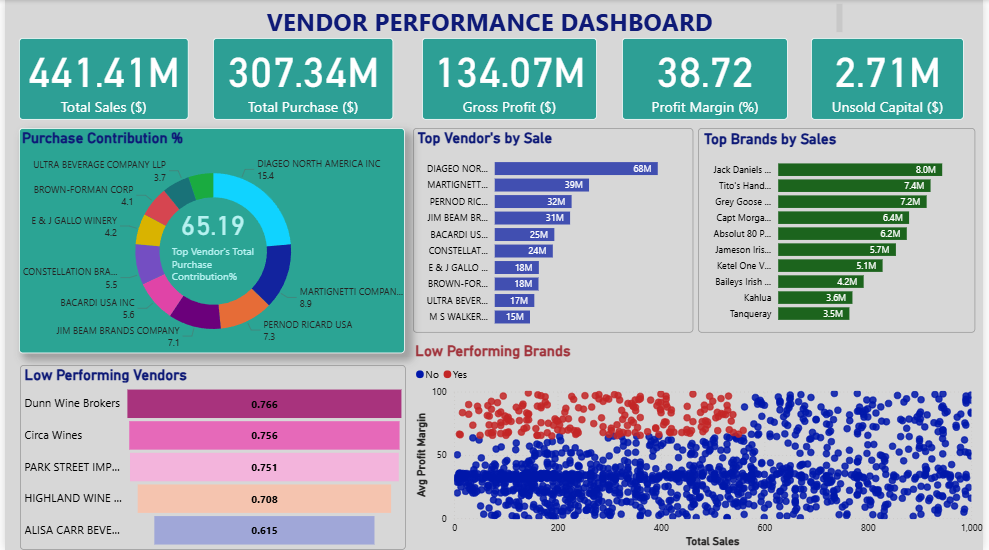

# Vendor Performance Analysis | Retail Inventory & Sales

_Analyzing vendor efficiencyand profitability to support strategic purchasing and inventory 
decisions using SQL, Python and PowerBi._

---

# Table of Contents
<a href="#overview">Overview</a>
<a href="#business-problem">Business Problem</a>
<a href="#dataset">Dataset</a>
<a href="#tools-technologies">Tools & Technologies</a>
<a href="#data-cleaning-preparation">Data cleaning & Preparation</a>
<a href="#exploratory-data-analysis-eda">Exploratory Data Analysis (EDA)</a>
<a href="#research-questions-key-finding">Research Questions & Key Finding</a>
<a href="#dashboard">Dashboard</a>
<a href="#final-recommendations">Final Recommendations</a>
<a href="#author-contact">Author Contact</a>

---
<h2>Overview</h2>
This Project evaluates Vendor Performance and retail inventory dynamics to drive strategies insights for 
purchasing, pricing and inventory optimization. A complete data pipeline was built using SQL for ETL, 
Pyhton for analysis and hypothesis testing, and Power BI for visualization.

---
<h2>Business Problem</h2>
This project aims to:
-Identify underperforming brands needing pricing or promotional adjustments.
-Determine vendor contributions to sales and profits.
-Analyze the cost-benefit of bulk purchasing.
-Investigate inventory turnover inefficiencies.
-Statistically validate differences in vendor profitability.

---
<h2>Dataset</h2>

-Multiple CSVs file located in data forlder.
-Summary table created from ingested data and used for analysis.

---
<h2>Tool's and Technologies</h2>

-SQL(CTEs, Joins, Filtering)
-Python(Pandas, Matplotlib, Seaborn, Scipy)
-Power Bi(Visualization)
-GitHub

---
<h2>Data cleaning & Preparation</h2>

-Removed transactions with:
    •	Gross Profit <= 0 
    •	Profit Margin <=0 
    •	Total Sales Quantity = 0 
  -Created summary tables with vendor-level metrics
  -Converted data types, handled outliers, merged lookups tables

---
<h2>Exploratory Data Analysis (EDA)</h2>

**NEGATIVE & ZERO VALUES:**
-Gross Profit: MIN -52002.78(loss making sales)
-Profit margin: Min -infinity (sales at 0 or below cost)
-Unsold Inventory: Indications slow moving stock

**OUTLIERS IDENTIFIED:**
-High freight cost (upto 275K)
-Large Purchase/Actual Prices

**Correlation Insights**
-Weak between Purchase Price and Profit
-Strong between Purchase and Sales quantity
-Negative between Profit margin and Sales price

---
<h2>Research Questions & Key Finding</h2>

1. **Brands for Promotional or Pricing Adjustments**: 198 Brands exhibit lower sales but higher profit margins
2. **Top Vendor’s by Sale & Purchase Contribution**:The top 10 vendors contribute 65.69% of total purchases - risk of Over-reliance
3. **Impact of Bulk Purchasing**:~72% cost-saving per unit on large orders
4. **Identifying Vendor’s with Low Inventory Turnover**: Total Unsold Inventory Capital: $2.71M
5. **Profit Margin Comparison: High vs. Low-Performing Vendors**:Top Vendors: Mean: 31.18%
Low Vendors: Mean: 41.57%
6. **Statistical Validation**:Statistically significant differences in profit margins - distinct vendor strategies.

---
<h2>Dashboard</h2>

---
<h2>Final Recommendations"</h2>

-Diversify Vendor base to reduce risks
-Optimize bulk order strategies
-Reprice slow-moving, high pricing brands
-Clear unsold inventory wisely
-Improve marketing for under performing brands

---
<h>Author Contact</h2>

**Simran Choudhary**
Data Analyst
Email: choudharysimran235002@gmail.com
[LinkedIn](https://www.linkedin.com/in/simran-choudhary-04a953299/)
[Portfolio](https://portfoliosimran23.netlify.app/)